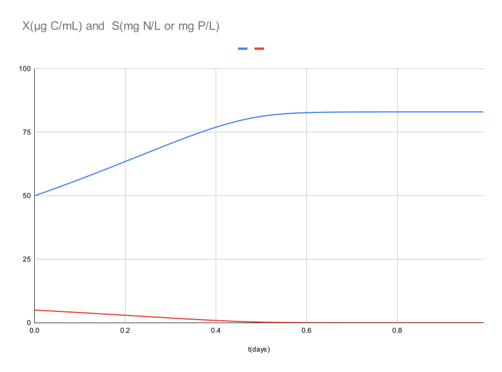

# Plankton

A C++ implementation of microalgae growth models using strict Test-Driven Development (TDD). This project models phytoplankton biomass dynamics using the Monod equation and numerical integration methods.

## Getting Started

These instructions will help you build and run the project on your local machine for development and testing purposes.

### Prerequisites

You'll need the following installed:

- C++23 compatible compiler (GCC 13+, Clang 16+, or MSVC 2022+)
- CMake 3.20 or higher
- Google Test (automatically fetched by CMake)
- CLion (recommended) or any C++ IDE

### Installing

Clone the repository and build the project:

```bash
git clone https://github.com/yourusername/Plankton.git
cd Plankton
```

Build using CMake:

```bash
mkdir build
cd build
cmake ..
cmake --build .
```

The compiled tests will be available in the build directory.

## Running the tests

Execute the test suite to verify all model behavior:

```bash
./build/PlanktonTests
```

### What the tests verify

The test suite validates:

- **Growth rate function correctness** - Monod equation implementation
- **Exponential biomass growth** - dX/dt = µ × X
- **Substrate consumption** - Coupled to biomass via yield coefficient
- **Stoichiometric mass balance** - ΔX = ΔS × Y_x/s
- **Edge cases** - Zero substrate, saturation conditions

### Test-Driven Development Approach

This project follows strict TDD methodology:

1. **Red**: Write a failing test
2. **Green**: Implement minimal code to pass
3. **Refactor**: Clean up while keeping tests green

All model behavior is validated through unit tests before implementation.

## Example Output

The simulation outputs comma-delimited time series data. This plot was generated from that output:



*100-step simulation showing biomass increase (blue) and substrate depletion (red) over 1 day with realistic phytoplankton parameters.*

## Current Implementation Status

### ✅ Completed
- Monod growth rate function with comprehensive tests
- Euler integration for single time steps
- Data structures for state and parameters
- Stoichiometric mass balance verification
- Multi-step simulation function returning time series
- Substrate depletion handling (clamp to zero)
- Demo program outputting growth simulation data
- CMake build system with Google Test

### 🚧 Planned Features
- CSV export for time-series data
- Parameter validation and error handling
- Beer-Lambert light attenuation model
- Light-limited growth coupling
- Runge-Kutta integration methods

## Built With

* [C++23](https://en.cppreference.com/w/cpp/23) - Modern C++ standard
* [CMake](https://cmake.org/) - Build system
* [Google Test](https://github.com/google/googletest) - Testing framework
* [CLion](https://www.jetbrains.com/clion/) - Development environment

## Scientific Background

### Monod Equation
The Monod equation describes microbial growth rate as a function of limiting substrate concentration:

```
µ = µ_max × (S / (K_s + S))
```

Where:
- µ = specific growth rate (1/h)
- µ_max = maximum specific growth rate (1/h)
- S = substrate concentration (g/L)
- K_s = half-saturation constant (g/L)

## Development Roadmap

See [AGENTS.md](AGENTS.md) for detailed development roadmap and design decisions.

## Authors

* Rich Nistuk 
  - [github.com/rnistuk](https://github.com/rnistuk)
  - [linkedin.com/in/rnistuk](https://linkedin.com/in/rnistuk)
  - [www.danzisoft.ca](https://www.danzisoft.ca)


## License

This project is licensed under the MIT License - see the [LICENSE.md](LICENSE.md) file for details

## Acknowledgments

* Inspired by classical microbial growth kinetics literature
* Built with modern C++ best practices and TDD methodology
