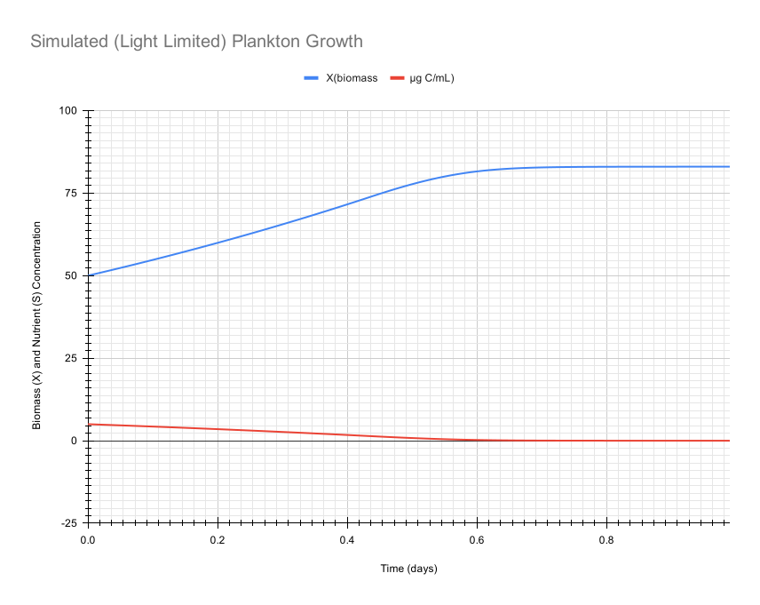

# Plankton

A C++ implementation of microalgae growth models using strict Test-Driven 
Development (TDD). This project models phytoplankton biomass dynamics using the 
Monod equation and numerical integration methods.

There's a company in the Metchosin/Langford area called [Industrial 
Plankton](https://industrialplankton.com/) that I found while exploring the 
industrial parks, looking for cool places to work. They even have a 
[github repo](https://github.com/industrial-plankton)!

I really enjoy making population dynamical models, so I thought I'd give 
plankton a try!

## Getting Started

These instructions will help you build and run the project on your local machine for development and testing purposes.

### Prerequisites

You'll need the following installed:

- C++23 compatible compiler (GCC 13+, Clang 16+, or MSVC 2022+)
- CMake 3.20 or higher
- Google Test (automatically fetched by CMake)
- CLion (recommended) or any C++ IDE

### Installing

Clone the repository and build the project:

```bash
git clone https://github.com/yourusername/Plankton.git
cd Plankton
```

Build using CMake:

```bash
mkdir build
cd build
cmake ..
cmake --build .
```

The compiled tests will be available in the build directory.

## Running the tests

Execute the test suite to verify all model behavior:

```bash
./build/PlanktonTests
```

### What the tests verify

The test suite validates:

- **Growth rate function correctness** - Monod equation implementation
- **Exponential biomass growth** - dX/dt = µ × X
- **Substrate consumption** - Coupled to biomass via yield coefficient
- **Stoichiometric mass balance** - ΔX = ΔS × Y_x/s
- **Edge cases** - Zero substrate, saturation conditions
- **Beer-Lambert light attenuation** - Point irradiance and depth-averaged irradiance
- **Mortality/decay term** - Specific death rate kd (dX/dt = µX - kdX)
- **Reactor geometry validation** - Constructor-enforced parameter constraints
- **Numerical safety** - Biomass and substrate clamped to zero; Beer-Lambert guard prevents NaN from near-zero biomass

### Test-Driven Development Approach

This project follows strict TDD methodology:

1. **Red**: Write a failing test
2. **Green**: Implement minimal code to pass
3. **Refactor**: Clean up while keeping tests green

All model behavior is validated through unit tests before implementation.

## Example Output

The simulation outputs comma-delimited time series data. These plots were 
generated from that output:


*100-step simulation showing biomass increase (blue) and substrate depletion 
(red) over 1 day with realistic phytoplankton parameters.*



*100-step simulation over 1 day showing biomass (X) increase and substrate (S) 
depletion with light-limited growth. Growth rate is governed by Liebig's Law — 
the minimum of substrate and depth-averaged irradiance (Beer-Lambert) limitation.*


*1000-step simulation over 10 days showing biomass (X) increase, substrate (S)
depletion with light-limited growth and mortality.

## Current Implementation Status

### ✅ Completed
- Monod growth rate function with comprehensive tests
- Euler integration for single time steps
- Data structures for state and parameters
- Stoichiometric mass balance verification
- Multi-step simulation function returning `vector<SimulationRecord>` with X, S, and I_avg per step
- Substrate depletion handling (clamp to zero, growth cessation verified)
- Parameter and state validation with descriptive error messages
- ReactorGeometry structure with constructor validation
- Beer-Lambert point irradiance model: I(z) = I₀ × exp(-k × X × z)
- Depth-averaged irradiance model for well-mixed reactor
- Light-limited growth coupling via Liebig's Law: µ = µ_max × min(S/(Ks+S), I_avg/(Ki+I_avg))
- ReactorGeometry passed into `simulate()` — fully configurable, no hardcoded values
- Mortality/decay term (`kd`) — enables growth → peak → decline dynamics
- Biomass clamped to zero under high mortality; substrate clamped to zero on depletion
- All `MonodParameters` validated in constructor — invalid objects are unconstructable
- Beer-Lambert near-zero guard prevents NaN/inf from denormal biomass values
- CSV export (`writeCsv`) — writes header and fixed-precision time series to any `ostream`
- Public API: `simulate(num_steps, MonodState, SimulationParameters)` — clean entry point for CLI and GUI consumers
- Public/internal header split — consumers include only `Simulation.h`, `SimulationParameters.h`, `CsvExport.h`, and data structs
- Static library (`plankton_lib`) — simulation code built as a reusable STATIC library; CLI and future GUI link against it
- `cli/` subdirectory — standalone CMake project for the command-line interface, links against `plankton_lib`
- CMake `PLANKTON_SOURCES` variable eliminates source list duplication between library and test targets
- CMake build system with Google Test

### 🔮 Planned Features
- Runge-Kutta integration methods

## Built With

* [C++23](https://en.cppreference.com/w/cpp/23) - Modern C++ standard
* [CMake](https://cmake.org/) - Build system
* [Google Test](https://github.com/google/googletest) - Testing framework
* [CLion](https://www.jetbrains.com/clion/) - Development environment

## Scientific Background

### Monod Equation
The Monod equation describes microbial growth rate as a function of limiting substrate concentration:

```
µ = µ_max × (S / (K_s + S))
```

Where:
- µ = specific growth rate (1/h)
- µ_max = maximum specific growth rate (1/h)
- S = substrate concentration (g/L)
- K_s = half-saturation constant (g/L)

## Development Roadmap

See [AGENTS.md](AGENTS.md) for detailed development roadmap and design decisions.

## Authors

* Rich Nistuk 
  - [github.com/rnistuk](https://github.com/rnistuk)
  - [linkedin.com/in/rnistuk](https://linkedin.com/in/rnistuk)
  - [www.danzisoft.ca](https://www.danzisoft.ca)


## License

This project is licensed under the MIT License - see the [LICENSE.md](LICENSE.md) file for details

## Acknowledgments

* Inspired by classical microbial growth kinetics literature
* Built with modern C++ best practices and TDD methodology
