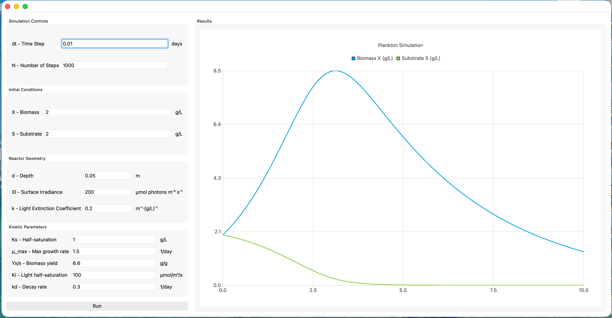

# Plankton

A C++ implementation of microalgae growth models using strict Test-Driven 
Development (TDD). This project models phytoplankton biomass dynamics using the 
Monod equation and numerical integration methods.

There's a company in the Metchosin/Langford area called [Industrial 
Plankton](https://industrialplankton.com/) that I found while exploring the 
industrial parks, looking for cool places to work. They even have a 
[github repo](https://github.com/industrial-plankton)!

I really enjoy making population dynamical models, so I thought I'd give 
plankton a try!

## Getting Started

These instructions will help you build and run the project on your local machine 
for development and testing purposes.

### Prerequisites

You'll need the following installed:

- C++23 compatible compiler (GCC 13+, Clang 16+, or MSVC 2022+)
- CMake 4.1 or higher
- Google Test (automatically fetched by CMake)
- Qt6 (Widgets, Charts) — required for the GUI target only
- CLion (recommended) or any C++ IDE

### Installing

Clone the repository and build the project:

```bash
git clone https://github.com/rnistuk/Plankton.git
cd Plankton
```

Build using CMake:

```bash
mkdir build
cd build
cmake ..
cmake --build .
```

The compiled tests will be available in the build directory.

## Running the tests

Execute the simulation test suite:

```bash
./build/plankton/PlanktonTests
```

Execute the GUI test suite:

```bash
./build/gui/GuiTests
```

Run the CLI demo (outputs CSV to stdout):

```bash
./build/cli/cli
```

The static library is at `build/plankton/libplankton_lib.a`.

### What the tests verify

The test suite validates:

- **Growth rate function correctness** - Monod equation implementation
- **Exponential biomass growth** - dX/dt = µ × X
- **Substrate consumption** - Coupled to biomass via yield coefficient
- **Stoichiometric mass balance** - ΔX = ΔS × Y_x/s
- **Edge cases** - Zero substrate, saturation conditions
- **Beer-Lambert light attenuation** - Point irradiance and depth-averaged irradiance
- **Mortality/decay term** - Specific death rate kd (dX/dt = µX - kdX)
- **Reactor geometry validation** - Constructor-enforced parameter constraints
- **Numerical safety** - Biomass and substrate clamped to zero; Beer-Lambert guard prevents NaN from near-zero biomass

### Test-Driven Development Approach

This project follows strict TDD methodology:

1. **Red**: Write a failing test
2. **Green**: Implement minimal code to pass
3. **Refactor**: Clean up while keeping tests green

All model behavior is validated through unit tests before implementation.

## Example Output



*Plankton Application showing biomass (X) and substrate (S) time series with configurable reactor geometry, kinetic parameters, and simulation controls.*

## Current Implementation Status

### ✅ Completed
- Monod growth rate function with comprehensive tests
- Euler integration for single time steps
- Data structures for state and parameters
- Stoichiometric mass balance verification
- Multi-step simulation function returning `vector<SimulationRecord>` with X, S, and I_avg per step
- Substrate depletion handling (clamp to zero, growth cessation verified)
- Parameter and state validation with descriptive error messages
- ReactorGeometry structure with constructor validation
- Beer-Lambert point irradiance model: I(z) = I₀ × exp(-k × X × z)
- Depth-averaged irradiance model for well-mixed reactor
- Light-limited growth coupling via Liebig's Law: µ = µ_max × min(S/(Ks+S), I_avg/(Ki+I_avg))
- ReactorGeometry passed into `simulate()` — fully configurable, no hardcoded values
- Mortality/decay term (`kd`) — enables growth → peak → decline dynamics
- Biomass clamped to zero under high mortality; substrate clamped to zero on depletion
- All `MonodParameters` validated in constructor — invalid objects are unconstructable
- Beer-Lambert near-zero guard prevents NaN/inf from denormal biomass values
- CSV export (`writeCsv`) — writes header and fixed-precision time series to any `ostream`
- Public API: `simulate(const MonodState&, const SimulationParameters&, const LightModel&, bool& stop)` — clean entry point for CLI and GUI consumers; `bool& stop` allows mid-run interruption
- Public/internal header split — consumers include only `Simulation.h`, `SimulationParameters.h`, `CsvExport.h`, and data structs
- Static library (`plankton_lib`) — simulation code built as a reusable STATIC library; both `cli/` and `gui/` link against it
- `cli/` subdirectory — command-line interface; runs a 1000-step simulation and writes CSV to stdout
- `gui/` subdirectory — Qt6 dashboard GUI with parameter input panels and live chart output (in progress; all four input panels have typed accessors, `MainWindow` orchestration is complete with a Run button and initial render, and `Results::setRecords()` reuses stable member series — full test coverage in the `GuiTests` target. Live-update wiring is the active workstream)
- CMake `PLANKTON_SOURCES` variable eliminates source list duplication between library and test targets
- CMake build system with Google Test
- `Results::setRecords()` — `xSeries`/`sSeries` are members initialised once in the ctor with object names `"X"`/`"S"`; axes created once in the ctor with titles; `setRecords()` calls `clear()`+`append()` and updates axis ranges explicitly (`[0, t_max]` horizontal, `[0, maxConc × 1.01]` vertical)

### 🔮 Planned Features
- **Generic integration refactoring + RK2/RK4** — make `eulerStep` model-agnostic: integrator takes a state vector and a `derivative_fn` callable, returns a new state vector; Monod kinetics move into a separate derivative function. Open decision: state vector type (`std::vector<double>` vs `std::array<double, N>`). Once done, RK2/RK4 is a new function with the same signature. See AGENTS.md for full design.
- Separate N and P tracking — replace generic substrate S with distinct nitrogen and phosphorus state variables; dual nutrient limitation via Liebig's Law
- 1D spatial light profile — extend from depth-averaged scalar to PDE
- GUI live-update wiring — when any parameter is edited, the chart re-renders automatically:
  - Each input panel emits `parametersChanged()` after each `QLineEdit::editingFinished`
  - `QDoubleValidator` / `QIntValidator` on every input so the signal only fires for acceptable values
  - Synchronous on the GUI thread first; revisit with `std::stop_token` if updates feel sluggish

## Built With

* [C++23](https://en.cppreference.com/w/cpp/23) - Modern C++ standard
* [CMake](https://cmake.org/) - Build system
* [Google Test](https://github.com/google/googletest) - Testing framework
* [Qt6](https://www.qt.io/) - GUI framework (Widgets, Charts)
* [CLion](https://www.jetbrains.com/clion/) - Development environment

## Model Description

### Light-Limited Growth (Liebig's Law)
Growth rate is governed by whichever of nutrient or light is most limiting:

```
µ = µ_max × min( S / (Ks + S),  I_avg / (Ki + I_avg) )
```

Where:
- µ = specific growth rate (1/day)
- µ_max = maximum specific growth rate (1/day)
- S = substrate (nutrient) concentration (g/L)
- Ks = half-saturation constant for nutrient (g/L)
- I_avg = depth-averaged irradiance (µmol photons m⁻² s⁻¹)
- Ki = half-saturation constant for light (µmol photons m⁻² s⁻¹)

### Biomass and Substrate Dynamics
Biomass grows at the net rate (growth minus mortality) and substrate is consumed proportionally:

```
dX/dt = (µ - kd) × X
dS/dt = -(µ / Yx_s) × X
```

Where:
- X = biomass concentration (g/L)
- kd = specific decay rate (1/day)
- Yx_s = biomass yield coefficient (g biomass / g substrate)

### Beer-Lambert Light Attenuation
The culture self-shades: as biomass X increases, light penetrates less deeply, reducing I_avg, which in turn reduces µ via Liebig's Law. This creates a negative feedback — dense cultures grow more slowly due to light limitation even when nutrients are abundant. Irradiance decays exponentially with depth through the culture:

```
I(z) = I₀ × exp(-k × X × z)
```

Depth-averaged over the full reactor:

```
I_avg = (I₀ / (k × X × d)) × (1 - exp(-k × X × d))
```

Where:
- I₀ = surface irradiance (µmol photons m⁻² s⁻¹)
- k = light extinction coefficient (m⁻¹ · (g/L)⁻¹)
- d = reactor depth (m)
- z = depth coordinate (m)

## Development Roadmap

See [AGENTS.md](AGENTS.md) for detailed development roadmap and design decisions.

## Authors

* Rich Nistuk 
  - [github.com/rnistuk](https://github.com/rnistuk)
  - [linkedin.com/in/rnistuk](https://linkedin.com/in/rnistuk)
  - [www.danzisoft.ca](https://www.danzisoft.ca)


## License

This project is licensed under the MIT License - see the [LICENSE.md](LICENSE.md) file for details

## Acknowledgments

* Inspired by classical microbial growth kinetics literature
* Built with modern C++ best practices and TDD methodology
